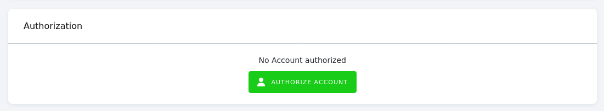

# LinkedIn Pages Extractor

This extractor downloads data about organizations, their posts, and statistics about performance of their pages, as well as tables of enumerated types used therein.

**Table of contents:**

[TOC]

<!-- ## Functionality notes -->

## Prerequisites

You must authorize the component configuration using the Keboola Connection OAuth interface in the global configuration part.


<!-- ## Features

| **Feature**             | **Note**                                      |
|-------------------------|-----------------------------------------------|
| Generic UI form         | Dynamic UI form                               |
| Row Based configuration | Allows structuring the configuration in rows. |
| oAuth                   | oAuth authentication enabled                  |
| Incremental loading     | Allows fetching data in new increments.       |
| Backfill mode           | Support for seamless backfill setup.          |
| Date range filter       | Specify date range.                           |

## Supported endpoints

If you need more endpoints, please submit your request to
[ideas.keboola.com](https://ideas.keboola.com/) -->

## Configuration

### Global configuraiton
 - Organizaton IDs (organizations) - [OPT] Comma separated list of organization ids you wish to fetch data from e.g. 123, 234. If left empty, data from all organizations will be fetched.

### Row configuration
 - Endpoints (endpoints) - [REQ] Select the data you wish to download. Lifetime statistics provide current totals. Time Bound statistics retrieve data about the specified time range with daily granularity. This must be either of these:
    - Page Statistics (Time Bound) to download time bound [Organization Page Statistics](https://learn.microsoft.com/en-us/linkedin/marketing/integrations/community-management/organizations/page-statistics?view=li-lms-2022-08&tabs=http). The time range is determined by Sync Options (see below).
    - Page Statistics (Lifetime) to download lifetime [Organization Page Statistics](https://learn.microsoft.com/en-us/linkedin/marketing/integrations/community-management/organizations/page-statistics?view=li-lms-2022-08&tabs=http).
    - Follower Statistics (Time Bound) to download time bound [Organization Follower Statistics](https://learn.microsoft.com/en-us/linkedin/marketing/integrations/community-management/organizations/follower-statistics?view=li-lms-2022-08&tabs=http). The time range is determined by Sync Options (see below).
    - Follower Statistics (Lifetime) to download lifetime [Organization Follower Statistics](https://learn.microsoft.com/en-us/linkedin/marketing/integrations/community-management/organizations/follower-statistics?view=li-lms-2022-08&tabs=http).
    - Share Statistics (Time Bound) to download time bound [Organization Share Statistics](https://learn.microsoft.com/en-us/linkedin/marketing/integrations/community-management/organizations/share-statistics?view=li-lms-2022-08&tabs=http). The time range is determined by Sync Options (see below).
    - Share Statistics (Lifetime) to download lifetime [Organization Share Statistics](https://learn.microsoft.com/en-us/linkedin/marketing/integrations/community-management/organizations/share-statistics?view=li-lms-2022-08&tabs=http).
    - Posts to download data about posts, their comments, and their likes.
    - Enumerated Types to download tables of enumerated types used in other data tables.
    - Organizations to download data about organizations themselves.
 - Sync Options (sync_options) [REQ] - Options pertaining only to time bound data extraction:
    - Date From (date_from) - [REQ] Date from which data is downloaded. Either date in `YYYY-MM-DD` format or dateparser string i.e. `5 days ago`, `1 month ago`, `yesterday`, etc. You can also set this as `last run`, which will fetch data from the last run of the component; if no previous successful run exists, all data since LinkedIn launch (2003-05-05) get downloaded. Values always get rounded down to the beginning of the day.
    - Date To (date_to) - [REQ] Date to which data is downloaded. Either date in `YYYY-MM-DD` format or dateparser string i.e. `5 days ago`, `1 week ago`, `now`, etc. Values always get rounded down to the beginning of the day.
 - Destination (destination) - [REQ] Options specifying how to save extracted data into Keboola Storage:
    - Load Type (load_type) - [REQ] If Full load is used, the destination table will be overwritten every run. If Incremental load is used, data will be upserted into the destination table.

### Sample Configuration
This sample configuration will download daily time bound Organization Follower Statistics about organizations with IDs equal to 69746054 and 76989094 from the day of the last component run up to today (excluded, i. e. today's possibly incomplete data will **not** be included), and upsert the resultant data into the Keboola Storage table called `time_bound_follower_statistics`.
```json
{
   "organizations": "69746054, 76989094",
   "endpoints": "follower_statistics_time_bound",
   "sync_options": {
      "date_from": "last run",
      "date_to": "today"
   },
   "destination": {
      "load_type": "incremental_load"
   }
}
```

## Output
The output of each configuration row is 1 to N tables with hardcoded name(s) as specified below for each case of the Endpoints row configuration option. Where present, time range columns' values are converted from [Unix time](https://en.wikipedia.org/wiki/Unix_time) into [ISO 8601](https://en.wikipedia.org/wiki/ISO_8601) encoded date and time strings. Tables are **not** created if they would end up empty.

<!-- List of tables, foreign keys, schema. -->
### Page Statistics (Time Bound)
Time Bound Organization Page Statistics are extracted as a table called `time_bound_page_statistics` that contains all [the fields the API provides](https://learn.microsoft.com/en-us/linkedin/marketing/integrations/community-management/organizations/page-statistics?view=li-lms-2022-08&tabs=http#sample-response-1) unwrapped and flattened as columns (with the underscore `_` used as a separator).

The primary key is composed of these these columns: `organization`, `timeRange_start`, `timeRange_end`.

### Page Statistics (Lifetime)
Lifetime Organization Page Statistics are extracted as a table called `total_page_statistics` that contains grand totals, and a set of tables called `page_statistics_by_{enumerated_type}` for each available enumerated type that contain metrics sliced by the given enumerated type dimension. All tables contain all [the fields the API provides](https://learn.microsoft.com/en-us/linkedin/marketing/integrations/community-management/organizations/page-statistics?view=li-lms-2022-08&tabs=http#sample-response) unwrapped and flattened as columns (with the underscore `_` used as a separator). 

The primary key is composed of these columns: `organization`, and, where the data is sliced by an enumerated type, `{enumerated_type}`.

### Follower Statistics (Time Bound)
Time Bound Organization Follower Statistics are extracted as a table called `time_bound_follower_statistics` that contains all [the fields the API provides](https://learn.microsoft.com/en-us/linkedin/marketing/integrations/community-management/organizations/follower-statistics?view=li-lms-2022-08&tabs=http#sample-response-1) unwrapped and flattened as columns (with the underscore `_` used as a separator).

The primary key is composed of these these columns: `organizationalEntity`, `timeRange_start`, `timeRange_end`.

### Follower Statistics (Lifetime)
Lifetime Organization Follower Statistics are extracted as a set of tables called `follower_counts_by_{enumerated_type}` for each [available enumerated type](https://learn.microsoft.com/en-us/linkedin/marketing/integrations/community-management/organizations/follower-statistics?view=li-lms-2022-08&tabs=http#demographic-facets) that contain metrics sliced by the given enumerated type dimension. All tables contain all [the fields the API provides](https://learn.microsoft.com/en-us/linkedin/marketing/integrations/community-management/organizations/follower-statistics?view=li-lms-2022-08&tabs=http#sample-response) unwrapped and flattened as columns (with the underscore `_` used as a separator). 

The primary key is composed of these these columns: `organizationalEntity`, and, where the data is sliced by an enumerated type, `{enumerated_type}`.

### Share Statistics (Time Bound)
Time Bound Organization Share Statistics are extracted as a table called `time_bound_share_statistics` that contains all [the fields the API provides](https://learn.microsoft.com/en-us/linkedin/marketing/integrations/community-management/organizations/share-statistics?view=li-lms-2022-08&tabs=http#share-statistics-data-schema) unwrapped and flattened as columns (with the underscore `_` used as a separator).

The primary key is composed of these these columns: `organizationalEntity`, `timeRange_start`, `timeRange_end`.

### Page Statistics (Lifetime)
Lifetime Organization Share Statistics are extracted as a table called `total_share_statistics` that contains all [the fields the API provides](https://learn.microsoft.com/en-us/linkedin/marketing/integrations/community-management/organizations/share-statistics?view=li-lms-2022-08&tabs=http#share-statistics-data-schema) unwrapped and flattened as columns (with the underscore `_` used as a separator).

The primary key is composed of only the column `organizationalEntity`.

### Posts
Data about posts, their comments, and their likes are extracted as tables called `posts`, `comments`, and `likes`. These tables contain all the fields the API provides for each case: [Posts](https://learn.microsoft.com/en-us/linkedin/marketing/integrations/community-management/shares/posts-api?view=li-lms-2022-08&tabs=http#post-schema), [Comments](https://learn.microsoft.com/en-us/linkedin/marketing/integrations/community-management/shares/comments-api?view=li-lms-2022-08&tabs=http), [Likes](https://learn.microsoft.com/en-us/linkedin/marketing/integrations/community-management/shares/network-update-social-actions?view=li-lms-2022-08&tabs=http#retrieve-likes-on-shares). In each case the fields are flattened as columns (with the underscore `_` used as a separator).

The primary key is composed of only the column `URN` in case of `likes`, or the column `id` in case of `posts` and `comments`.

### Enumerated types
All Enumerated types' values for Countries, Functions, Industries, Regions and Seniorities are extracted as a tables called `countries`, `functions`, `industries`, `regions` and `seniorities` that contain fields needed to make sense of the pertinent dimension slicing in Lifetime Statistics tables. See the [appropriate documentation pages](https://learn.microsoft.com/en-us/linkedin/shared/references/v2/standardized-data?context=linkedin%2Fmarketing%2Fcontext&view=li-lms-2022-08) for more info.

The primary key is composed of only the column `id`.

### Organizations
Data about each available or specified Organization are extracted as a table called `organizations` that contains all [the fields the API provides](https://learn.microsoft.com/en-us/linkedin/marketing/integrations/community-management/organizations/organization-lookup-api?view=li-lms-2022-08&tabs=http#sample-response) unwrapped and flattened as columns (with the underscore `_` used as a separator).

The primary key is composed of only the column `id`.

## Development

If required, change local data folder (the `CUSTOM_FOLDER` placeholder) path to your custom path in
the `docker-compose.yml` file:

~~~~~~~~~~~~~~~~~~~~~~~~~~~~~~~~~~~~~~~~~~~~~~~~~~~~~~~~~~~~~~~~~~~~~~~~~~~~~~~~
    volumes:
      - ./:/code
      - ./CUSTOM_FOLDER:/data
~~~~~~~~~~~~~~~~~~~~~~~~~~~~~~~~~~~~~~~~~~~~~~~~~~~~~~~~~~~~~~~~~~~~~~~~~~~~~~~~

Clone this repository, init the workspace and run the component with following command:

~~~~~~~~~~~~~~~~~~~~~~~~~~~~~~~~~~~~~~~~~~~~~~~~~~~~~~~~~~~~~~~~~~~~~~~~~~~~~~~~
docker-compose build
docker-compose run --rm dev
~~~~~~~~~~~~~~~~~~~~~~~~~~~~~~~~~~~~~~~~~~~~~~~~~~~~~~~~~~~~~~~~~~~~~~~~~~~~~~~~

Run the test suite and lint check using this command:

~~~~~~~~~~~~~~~~~~~~~~~~~~~~~~~~~~~~~~~~~~~~~~~~~~~~~~~~~~~~~~~~~~~~~~~~~~~~~~~~
docker-compose run --rm test
~~~~~~~~~~~~~~~~~~~~~~~~~~~~~~~~~~~~~~~~~~~~~~~~~~~~~~~~~~~~~~~~~~~~~~~~~~~~~~~~

## Integration

For information about deployment and integration with KBC, please refer to the
[deployment section of developers documentation](https://developers.keboola.com/extend/component/deployment/)
